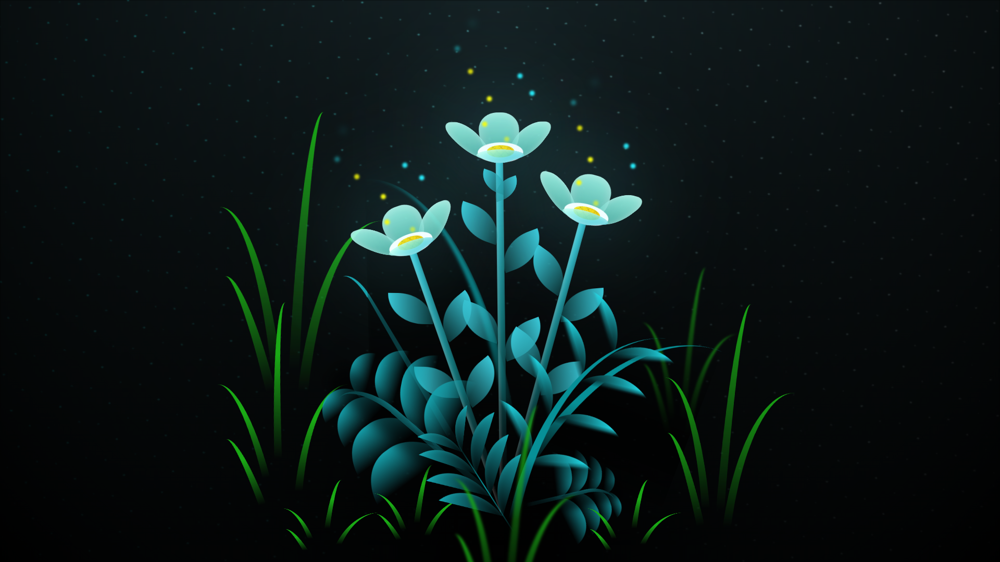

# Para Yasmim

Meu amor,

Hoje quero te dedicar estas palavras para expressar o que sinto por você. Desde que te conheci, minha vida mudou para melhor. Você trouxe luz, alegria e amor para cada momento que compartilhamos juntos.

Cada dia ao seu lado é como uma linda flor que desabrocha, trazendo cor e perfume para a minha vida. Seu sorriso é a minha inspiração, e o seu amor é o meu refúgio. 

Quero que saiba que te amo mais do que palavras podem expressar. Você é a pessoa mais especial para mim, e estar ao seu lado é o meu maior presente.

Com todo o meu amor,
Eduardo
